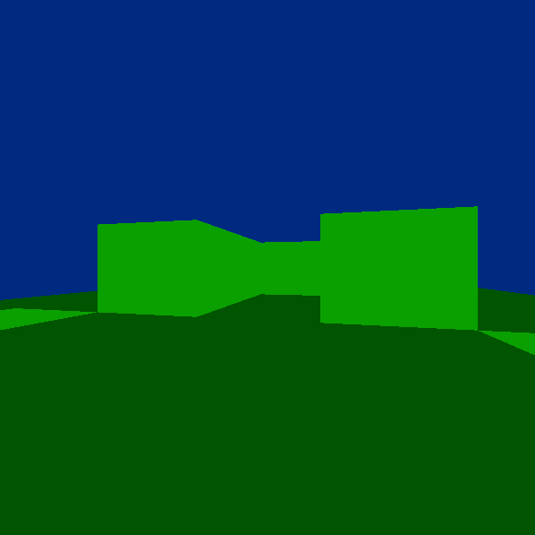

# Smart Bugs
---

### Description

Adapt python bugs into C in a 3D environment.

Version: *pre-beta 0.0.1a*

### Author
---
* [Chris Closser](https://github.com/chelseadole/write-me)

### Getting Started
---

##### *Prerequisites*
* [gcc 7+](https://packages.debian.org/sid/gcc-7)
* [g++ 7+](https://packages.ubuntu.com/artful/g++-7)
* [git](https://git-scm.com/)

`$ sudo apt install gcc-7 g++-7`

Enter this line in order to use version 7 of [gcc and g++](https://askubuntu.com/a/837621)

`$ ls -la /usr/bin/ | grep -oP "[\S]*(gcc|g\+\+)(-[a-z]+)*[\s]" | xargs bash -c 'for link in ${@:1}; do sudo ln -s -f "/usr/bin/${link}-${0}" "/usr/bin/${link}"; done' 7`

Build

`$ gcc main.c -lm -lSDL2main -lSDL2 -o bugs`

Make

`$ make; ./bugs`

`$ ./bugs`

Controls:

    move: W,A,S,D

    turn: H,L

    exit: END, ESCAPE

---
### 3D Environment Adapted From

* [Littlewolf](https://github.com/glouw/littlewolf)

Littlewolf aims to be a very minimalistic software graphics
engine reminiscent of the early wolfenstein and doom days.
